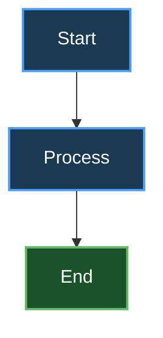
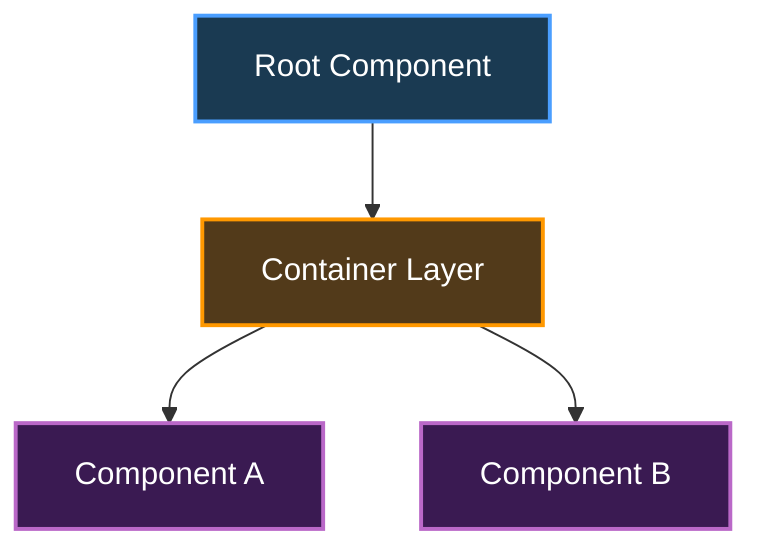

# Mermaid Chart Style Guidelines

## When to Use

- Generate flowcharts, component structure diagrams
- Generate sequence diagrams, state diagrams
- Any scenario requiring Mermaid charts

## Instructions

### Core Principle

**Dark background + white text** = Compatible with light/dark mode

```mermaid
classDef primaryClass fill:#1a3a52,stroke:#4a9eff,stroke-width:2px,color:#fff
```

## Standard Color Scheme

| Style Class | Fill | Stroke | Usage |
|--------|--------|--------|------|
| `primaryClass` | `#1a3a52` | `#4a9eff` | Primary components |
| `secondaryClass` | `#523a1a` | `#ff9800` | Secondary components |
| `successClass` | `#1a5229` | `#66bb6a` | Success state |
| `warningClass` | `#524a1a` | `#ffeb3b` | Warning state |
| `dangerClass` | `#521a1a` | `#ef5350` | Error state |
| `purpleClass` | `#3a1a52` | `#ba68c8` | Special components |

## Quick Template



## Prohibited

- ❌ Light background + dark text (`fill:#e1f5ff, color:#000`)
- ❌ Omit `color:#fff`
- ❌ Low contrast colors

## Component Structure Example



## Checklist

- [ ] All colored nodes use `color:#fff`
- [ ] Fill uses dark colors (lightness < 30%)
- [ ] Stroke uses bright colors (lightness > 50%)
- [ ] Add style comment `%% Light/dark mode compatible`
